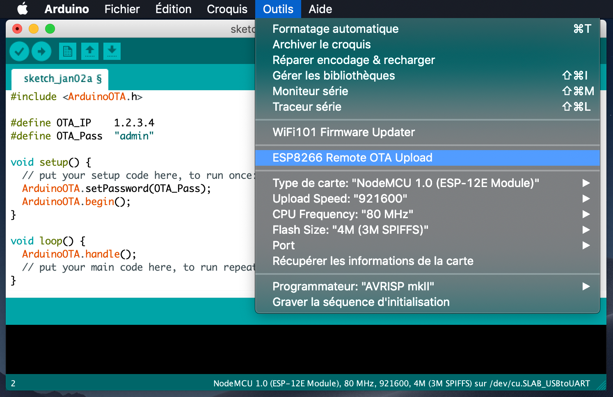

# arduino-espotafile-plugin
Arduino plugin for creating ESP8266 upgrade files via OTA. File need to be uploaded via web on SPIFFS
Tested with the following Arduino IDE versions: 1.8.8

## Installation
- Make sure you use one of the supported versions of Arduino IDE and have ESP8266 core installed.
- Download the tool archive from [releases page](https://github.com/SmartBlug/arduino-espota-plugin/releases/latest).
- Unpack the tool into `tools` directory (the path will look like `<sketchbook directory>/tools/ESP8266OTAFile/tool/esp8266OTAFile.jar)`.
- Restart Arduino IDE. 

## Usage
- Open a sketch (or create a new one and save it).
- Add this line to your sketch :
`#define OTA_Key     "12345"` to specify Software Key. This will be used to check if same key is present in file and confirm file is compatible before doing the upgrade
- Also add version :
`#define OTA_Version "0.1.1"` to add version description
- Compile your sketch and upload once normally with serial.
- Reset your board
- Check the IP address of your board and update ESPOTA.h accordingly.
- Select *Tools > ESP8266 Remote OTA File Creation* menu item. This generate the .upgrade file.
  When done, you can upload the file on SPIFFS with any manner.

## Sample
```
#define OTA_Key     "12345"
#define OTA_Version "0.1.1"

void setup() {
  // put your setup code here, to run once:
}

void loop() {
  // put your main code here, to run repeatedly:
}
```

## Screenshot



