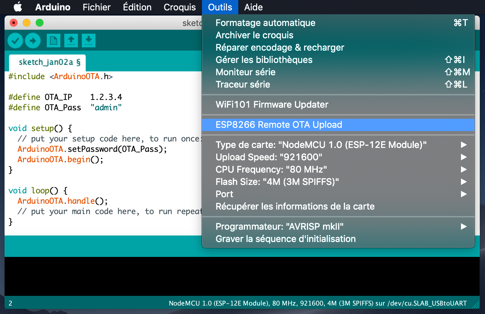

# arduino-espota-plugin
Arduino plugin for uploading files to ESP8266 via OTA, even if your device is not connected to same lan
Tested with the following Arduino IDE versions: 1.8.8

## Installation
- Make sure you use one of the supported versions of Arduino IDE and have ESP8266 core installed.
- Download the tool archive from [releases page](https://github.com/SmartBlug/arduino-espota-plugin/releases/latest).
- Unpack the tool into `tools` directory (the path will look like `<sketchbook directory>/tools/ESP8266OTA/tool/esp8266OTA.jar)`.
- Restart Arduino IDE. 

## Usage
- Open a sketch (or create a new one and save it).
- Add this line to your sketch :
`#define OTA_IP      1.2.3.4` to specify your device target IP
- *Optionnaly also add these lines* :
`#define OTA_Pass    "admin"` to add authentification to your update
`#define OTA_Port    5555` to specify a fixed source port (default is 5353)
- Make sure your sketch support ArduinoOTA.
- Compile your sketch and upload once normally with serial.
- Reset your board
- Check the IP address of your board and update ESPOTA.h accordingly.
- Select *Tools > ESP8266 Remote OTA Upload* menu item. This should start uploading the files into ESP8266.
  When done, your board will reboot with the new code. Might take a few minutes for large file system sizes.

## Sample
```
#include <ArduinoOTA.h>

#define OTA_IP      1.2.3.4
#define OTA_Pass    "admin"

void setup() {
  // put your setup code here, to run once:
  ArduinoOTA.setPassword(OTA_Pass);
  ArduinoOTA.begin();
}

void loop() {
  ArduinoOTA.handle();
  // put your main code here, to run repeatedly:
}
```

## Screenshot



